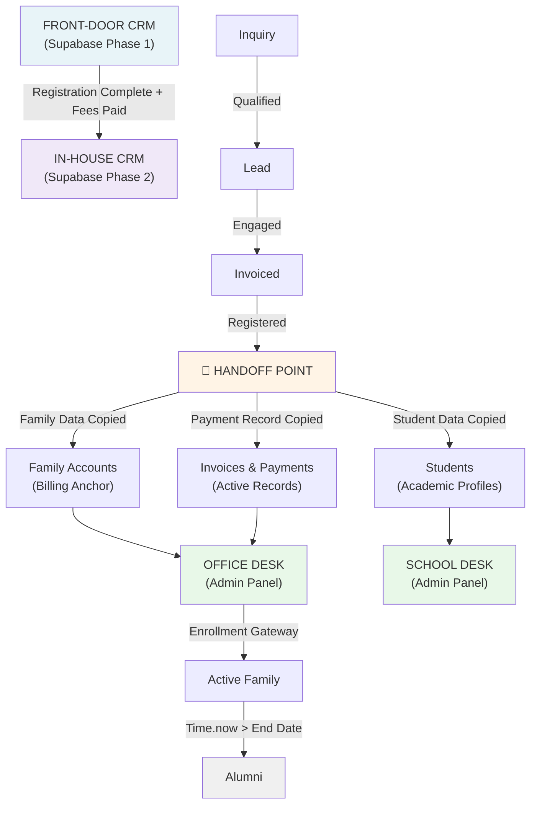
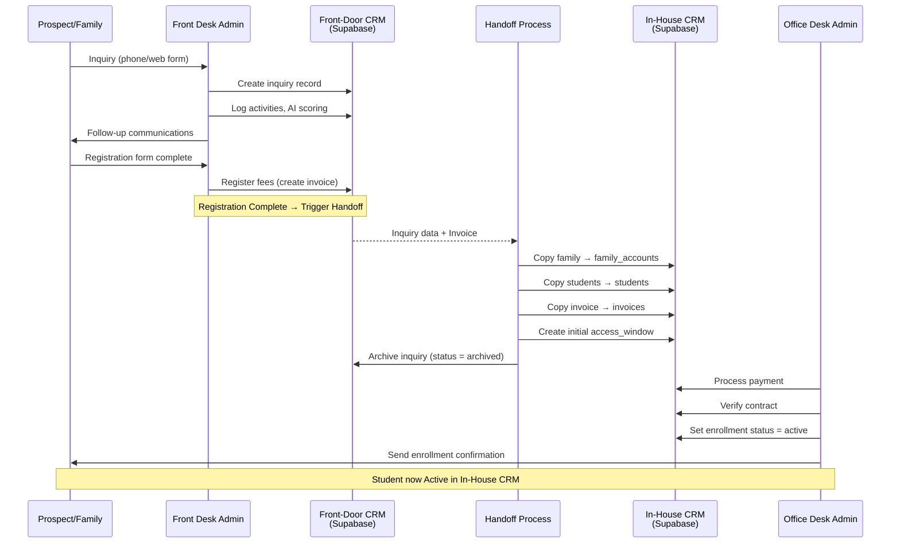

# Front-Door CRM & In-House CRM Architecture

## Overview

This system operates as a **single unified Supabase database** with **two distinct CRM phases** based on operational stage and user role. Families progress through a sales/marketing phase (Front-Door CRM) before transitioning to a student/family management phase (In-House CRM).

---

## System Model

## CRM Phases

### Phase 1: Front-Door CRM (Supabase)

**Purpose:** Sales, marketing, and public engagement up to registration completion.

**Users:** Pre-registered inquiries and leads (external to system).

**Desks:** Front Desk only.

**Lifecycle:**

1. Inquiry created (phone call, web form, email)
2. Lead qualified (AI agent scores, counselor assigned)
3. Invoice registered (registration fees charged)
4. Family registration form completed
5. Payment received or scheduled
6. **Data Archived:** Once registration is complete and fees are registered, the Front-Door CRM inquiry record is archived. The family data is copied to In-House CRM.

**Tables:**

- `front_door_inquiries` (inquiry queue, lead source, AI scoring)
- `front_door_activity_log` (all interactions: calls, emails, forms)
- `front_door_communication_log` (message content, timestamps, agent)

---

### Phase 2: In-House CRM (Supabase)

**Purpose:** Student enrollment, family account management, billing, access control, and alumni tracking.

**Users:** Registered families, students, teachers (phase 2), admin staff.

**Desks:** Office Desk (family/payment mgmt) + School Desk (student/class mgmt + alumni).

**Lifecycle:**

1. Family account activated (from Front-Door handoff)
2. Students enrolled (curriculum assigned, access window set)
3. Billing managed (invoices, payments, debit orders)
4. Classes and timetables assigned (School Desk)
5. Student completes program → alumni flag set
6. Alumni retains archive access

**Tables:**

- `family_accounts` (billing anchor, contact info, contracts)
- `users` (adults, students, teachers, admins—role-based)
- `students` (academic profile, curriculum, progress)
- `packages` (course/curriculum offerings)
- `invoices` (billing records)
- `debit_orders` (recurring charges)
- `payments` (payment records, reconciliation)
- `add_on_payments` (extras, merchandise)
- `family_activity` (immutable audit trail)

---

## Handoff Process

### Trigger

**When:**

- Registration form is complete
- Registration fees are invoiced OR payment is received

### Action

1. Copy family data from Front-Door CRM to In-House CRM
   - Family name, email, phone, address
   - Student details (name, DOB, curriculum preference)
   - Initial invoice and payment status
2. Archive Front-Door inquiry (soft delete or status = archived)
3. Create `family_accounts` record in In-House CRM
4. Create `users` records (parents/guardians)
5. Create `students` records (one per enrolled child)
6. Set initial invoice and access window in In-House CRM
7. Transition to Office Desk for family account setup and payment management

### No Data Duplication

- Front-Door CRM tables are separate from In-House CRM tables
- After handoff, all operations occur in In-House CRM only
- Front-Door CRM is read-only (archived inquiry reference only)

---

## Desks & Responsibilities

### Front Desk (Front-Door CRM)

- Receive inquiries (phone, web form, email)
- Score leads with AI agent (Nemotron)
- Assign counselors
- Send follow-ups and communication
- Log all activities
- Manage inquiry-to-invoice workflow
- Trigger handoff when registration complete

### Office Desk (In-House CRM)

- Manage family accounts
- Process payments and invoices
- Verify contracts and access windows
- Reconcile debit orders
- Handle billing disputes
- Monitor family status transitions

### School Desk (In-House CRM)

- Manage student enrollment
- Assign classes and curriculum
- Track progress and attendance (future)
- Manage access windows and permissions
- Flag alumni upon graduation
- Provide alumni archive access

---

## Data Migration on Handoff

| Data | Front-Door → In-House | Mapping |
|------|----------------------|---------|
| Inquiry record | Archived | `front_door_inquiries.status = 'archived'` |
| Family name, contact | Copied | `family_accounts.family_name`, email, phone |
| Student details | Copied | `students.name`, dob, curriculum_preference |
| Registration invoice | Referenced | Converted to `invoices` record in In-House CRM |
| First payment | Tracked | Converted to `payments` record in In-House CRM |
| Activity log | Archived | Front-Door log remains read-only reference |

---

## Access Control (RLS Policies)

### Front Desk Users

- **Read/write:** `front_door_inquiries`, `front_door_activity_log`, `front_door_communication_log`
- **Read-only:** Office Desk data (reference only)

### Office Desk Users

- **Read/write:** `family_accounts`, `invoices`, `debit_orders`, `payments`, `family_activity`
- **Read-only:** `students` (reference for billing)
- **No access:** Front-Door CRM

### School Desk Users

- **Read/write:** `students`, `classes`, `curriculum`, `timetable`, `family_activity` (append-only)
- **Read-only:** `family_accounts` (contact info reference)
- **No access:** Front-Door CRM, payment details

### Students & Parents (Via Web/Mobile App)

- **Read:** Their own `students` record, timetable, curriculum progress
- **No access:** Other families' data, billing, admin panels

---

## Sequence: Inquiry to Active Student

---

## Key Design Principles

1. **Single Database, Two Phases:** All data in Supabase. Phase separation is logical (tables + RLS policies), not physical.

2. **Clean Handoff:** Front-Door CRM is read-only after handoff. No two-way sync.

3. **No External CRM:** Everything lives in Supabase. (No HubSpot, no external tools.)

4. **Immutable Audit Trail:** Family Activity log in In-House CRM is append-only and immutable for compliance.

5. **Role-Based Access:** RLS policies enforce desk isolation. Front Desk cannot see Office/School Desk data.

6. **Alumni Retention:** Alumni records remain in School Desk with restricted access (read-only archive access).

---

## Schema Dependencies

### Front-Door CRM Tables (Migrations 1–?)

- `front_door_inquiries`
- `front_door_activity_log`
- `front_door_communication_log`

### In-House CRM Tables (Migrations 181–185, Phase 2)

- `family_accounts`
- `users` (parents, students, teachers, admin)
- `students`
- `packages`
- `invoices`
- `debit_orders`
- `payments`
- `add_on_payments`
- `family_activity`

### Handoff Logic (Edge Functions)

- **Trigger:** `on_registration_complete()`
- **Action:** Copy Front-Door → In-House, archive inquiry, set initial `access_window`

---

## Next Steps

- ✅ In-House CRM Tables: Migrations 181–185 complete (Office Desk schema)
- ⏳ Office Desk Edge Functions: Payment workflows, status transitions
- ⏳ Office Desk UI: Google Stitch export
- ⏳ Front-Door CRM Tables: Migrations for `front_door_*` tables
- ⏳ Front Desk Edge Functions: AI agent, Zadarma integration, inquiry workflows
- ⏳ Front Desk UI: Google Stitch export
- ⏳ Handoff Logic: Edge Function to execute data migration on registration complete
- ⏳ School Desk Tables: Phase 2 (after Office Desk + Front Desk complete)
- ⏳ School Desk Edge Functions & UI: Phase 2

---

## Document Version

| Field | Value |
|-------|-------|
| Last Updated | 2026-08-22 |
| Author | Cece |
| Status | Master Architecture Document (In Review) |
